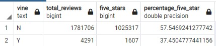

# Amazon_Vine_Analysis

---

## Overview of analysis

### In this module we achieved the following deliverables
    - Define big data and describe the challenges associated with it.
    - Define Hadoop and name the main elements of its ecosystem.
    - Explain how MapReduce processes data.
    - Define Spark and explain how it processes data.
    - Describe how NLP collects and analyzes text data.
    - Explain how to use AWS Simple Storage Service (S3) and relational databases for basic cloud storage.
    - Complete an analysis of an Amazon customer review.

Using this new knowledge we took Amazon customer reviews, used pyspark to create dataframes, uploaded the data to pgAdmin via connecting to Amazon RDS, and then performed some tranformations to display wanted data to perform analysis on review ratings.  

---

## Results

All of the following questions were answered with this SQL code:

```
WITH all_reviews as(
    SELECT
        vine, 
        count(review_id) AS total_reviews
    FROM vine_table
	GROUP BY vine
),
five_star_reviews as(
	SELECT
        vine, 
        count(star_rating) AS five_stars
    FROM vine_table
	WHERE star_rating = '5'
	GROUP BY vine
)
SELECT
	all_reviews.vine,
    total_reviews,
    five_stars,
    CAST(five_stars AS FLOAT)/CAST(total_reviews AS FLOAT)*100 AS percentage_five_star
FROM all_reviews
JOIN five_star_reviews ON all_reviews.vine = five_star_reviews.vine;
```


### How many Vine reviews and non-Vine reviews were there?
There are 1781706 non-Vine reviews and 4291 Vine Reviews.

### How many Vine reviews were 5 stars? How many non-Vine reviews were 5 stars?
We have 1025317 non-Vine 5 star reviews and 1607 Vine 5 star reviews.

### What percentage of Vine reviews were 5 stars? What percentage of non-Vine reviews were 5 stars?
Percentage of 5 star non-Vine reviews is 57.55% and 5 star Vine reviews is 37.45%.


---

## Summary

Looking at the data for video game products, there does not seem to be a positivity bias for the Vine program. If anything there are way less 5 star reviews that come from the program and we might want to look if there are more 1 star reviews in comparison. Non-Vine reviews have a higher tendency to like the product based off our findings, and Vine reviews seem to be more critical of the products. 

It might be worthwhile as stated above to compare the averages of Vine vs non-Vine. This would give insight as to if they influenced the products overall reviews. 